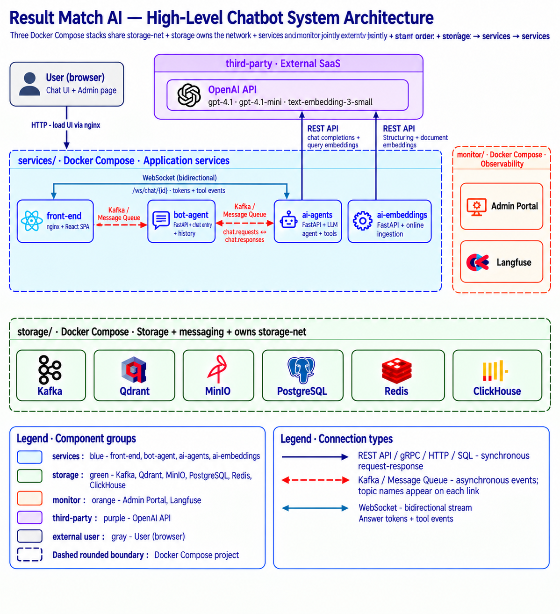
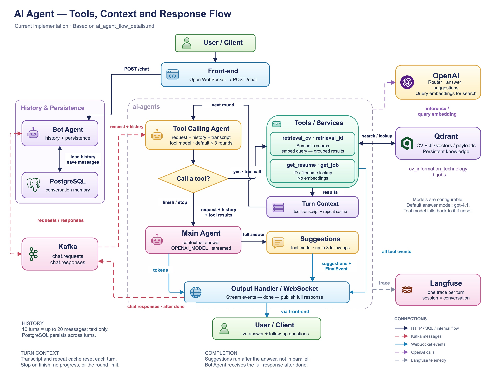
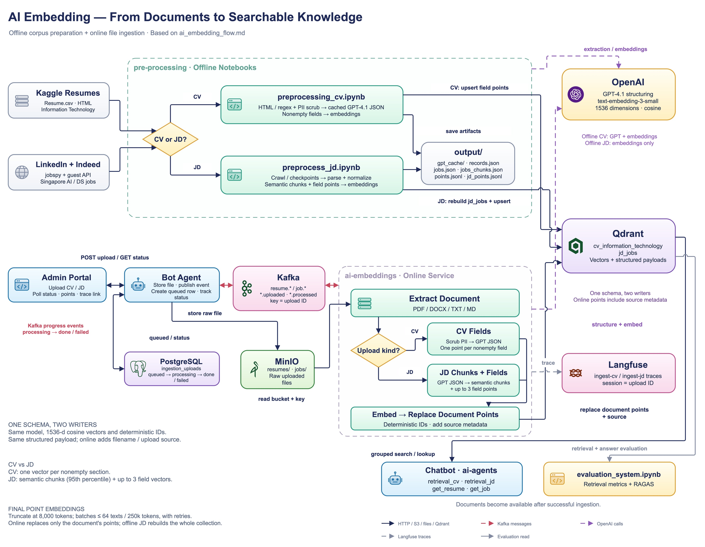
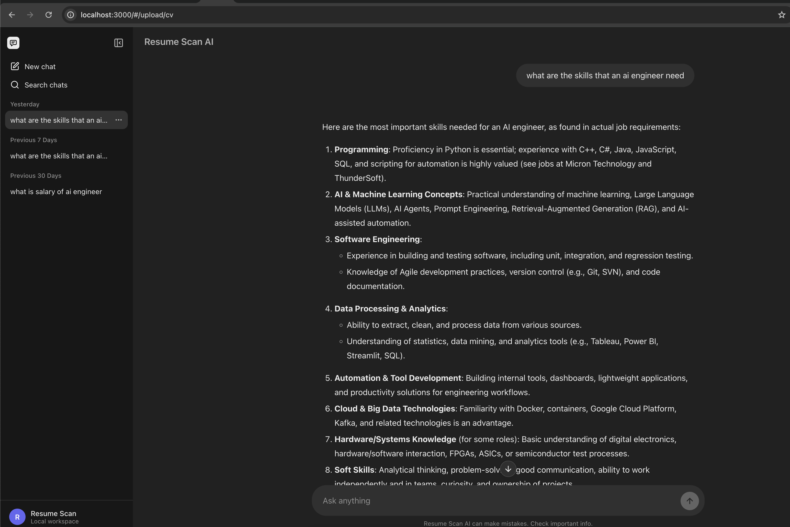
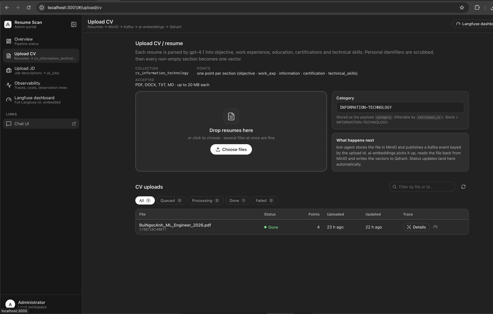
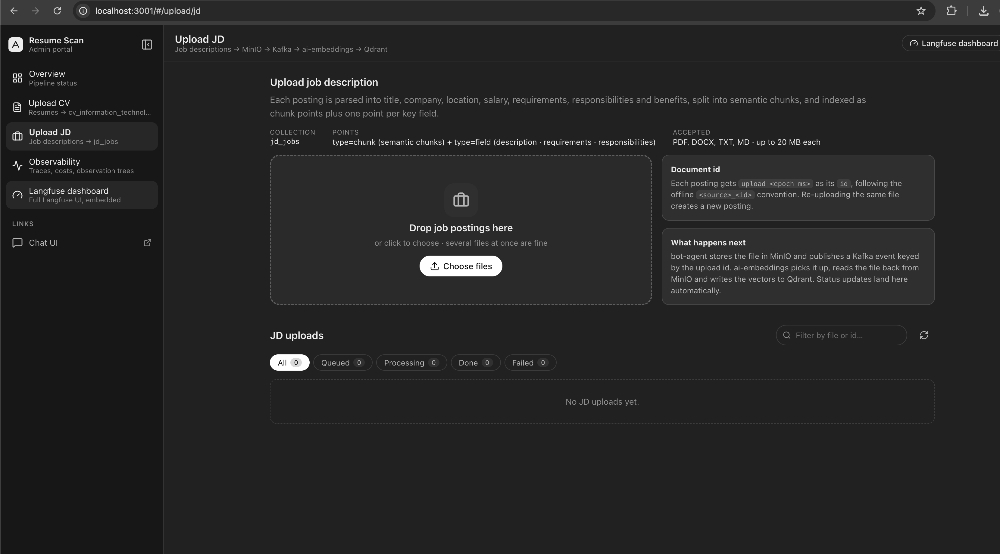
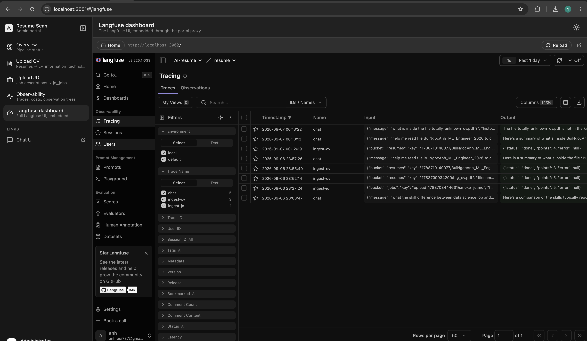
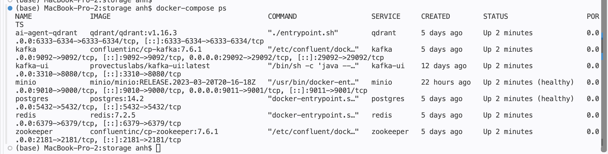
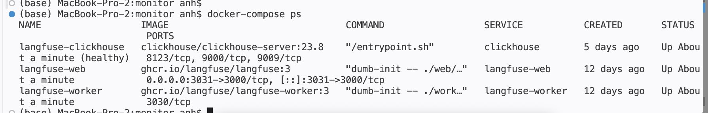
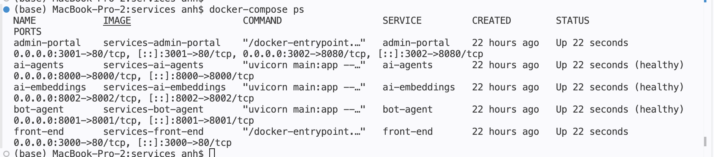

# ResuMatch AI

**An AI recruiting assistant that matches resumes to job descriptions through chat.**

Ask it *"find me backend engineers with 3+ years of Python"*, *"which candidates fit this data-science role in Singapore?"* or *"what is inside `my_cv.pdf`?"*. An LLM agent decides which retrieval tools to call, searches a Qdrant knowledge base of resumes and job postings, streams its answer token by token over a WebSocket, and proposes follow-up questions. Operators feed that knowledge base from a separate admin portal, and every chat turn and every upload is one Langfuse trace.

Built as an event-driven microservices platform: React chat UI, FastAPI services connected by Kafka, Qdrant vector search, full LLM observability with Langfuse, and a two-layer RAG evaluation suite (retrieval metrics + RAGAS hallucination detection).


---

## Contents

- [Features](#features)
- [Architecture](#architecture)
  - [1. High-level system](#1-high-level-system)
  - [2. AI agent: tools, context and response flow](#2-ai-agent-tools-context-and-response-flow)
  - [3. AI embedding: from documents to searchable knowledge](#3-ai-embedding-from-documents-to-searchable-knowledge)
- [Screens](#screens)
- [Tech stack](#tech-stack)
- [Getting started](#getting-started)
- [Observability](#observability)
- [Evaluation](#evaluation)
- [Development](#development)
- [Troubleshooting](#troubleshooting-local-docker-on-macos)
- [Roadmap](#roadmap)

## Features

- **ChatGPT-style UI** — streaming answers with stop/regenerate, markdown rendering with code highlighting, follow-up suggestion chips, date-grouped history with search, rename and delete, light/dark theme.
- **Two-stage LLM agent** — a tool model decides *which retrieval tools to call* in a bounded tool loop (max 3 rounds); the answer model writes the final reply from the tool transcript. Loop guards handle repeated calls, failed rounds and the hard round cap.
- **Semantic search over resumes and jobs** — `retrieval_cv` and `retrieval_jd` embed the query and run grouped Qdrant searches, so each hit is one distinct candidate or job with its best-matching sections.
- **Read a specific document** — `get_resume` / `get_job` fetch one document by id or by the file name it was uploaded with (exact → case-insensitive stem → fuzzy). An unknown file is reported instead of being replaced by a look-alike.
- **Event-driven backbone** — chat turns travel over Kafka (`chat.requests` / `chat.responses`) with an idempotent producer, at-least-once consumers and a dead-letter topic; answers stream to the browser over WebSocket.
- **Online ingestion + admin portal** — operators drop CVs and job descriptions in a separate admin UI; `bot-agent` stores the file in MinIO and emits a Kafka event, `ai-embeddings` structures and embeds it with the exact schema of the offline notebooks and upserts it into Qdrant, and the portal follows every file from `queued` to `done`.
- **Full observability** — every chat turn and every ingestion is one Langfuse trace (session = conversation / upload), down to per-round tool decisions, retriever payloads, token usage and latency. The admin portal lists traces, opens their observation tree in place and embeds the full Langfuse UI.
- **Measured, not vibes** — an evaluation package scores retrieval (MRR, accuracy@k, precision@k, NDCG@k, LLM-graded NDCG) and generation (RAGAS faithfulness, answer correctness/relevancy, context precision/recall) with a hallucination report.

## Architecture

The three diagrams below are the reference pictures of the system, from the outside in: the deployment topology, then what happens inside the agent during one chat turn, then how documents become vectors. The images live in [`doc/readme_graph/`](doc/readme_graph/); the editable sources (`.drawio`) and the text scripts they were drawn from are in [`doc/`](doc/).

### 1. High-level system



The system is three Docker Compose stacks plus two things outside them. Every dashed rounded box in the diagram is one Compose project, and every colour is one group:

| Group | Colour | Members | Where it runs |
|---|---|---|---|
| services | blue | front-end, bot-agent, ai-agents, ai-embeddings | [`services/docker-compose.yml`](services/docker-compose.yml) |
| storage | green | Kafka, Qdrant, MinIO, PostgreSQL, Redis (and ClickHouse, see note) | [`storage/docker-compose.yml`](storage/docker-compose.yml) — owns the shared network `storage-net` |
| monitor | orange | Langfuse (web + worker), Admin Portal | [`monitor/docker-compose.yml`](monitor/docker-compose.yml) |
| third-party | purple | OpenAI API (`gpt-4.1`, `gpt-4.1-mini`, `text-embedding-3-small`) | external SaaS |
| external user | grey | the browser: chat UI + admin page | outside all boundaries |

All three stacks join the same network, so containers talk to each other by service name. Start order is **storage → monitor → services**; stop in reverse.

Two drawing decisions to keep in mind when reading it: the **Admin Portal** is drawn in the orange monitor group because it is an operator tool, but its container is built by the services stack (port 3001). **ClickHouse** is drawn in the green storage row with the other datastores, but it is started by the monitor stack because it is Langfuse's analytics store.

Reading the arrows, from the top:

- **User → front-end / admin portal (HTTP).** nginx serves both React apps and proxies every `/api/*` call, so the browser never talks to a backend port directly.
- **front-end → bot-agent (REST).** `POST /api/chat`, conversations and message history.
- **front-end ⇄ ai-agents (WebSocket, blue double arrow).** `/ws/chat/{id}` carries answer tokens and tool events live to the browser.
- **bot-agent ⇄ ai-agents (Kafka, red dashed).** `chat.requests` out, `chat.responses` back. Topic names sit on the links.
- **bot-agent ⇄ ai-embeddings (Kafka).** `resume.uploaded` / `job.uploaded` out, `resume.processed` / `job.processed` back.
- **ai-agents → OpenAI (REST).** Chat completions and query embeddings. **ai-embeddings → OpenAI (REST).** Document structuring and document embeddings.
- **services → storage.** bot-agent writes PostgreSQL and MinIO; ai-agents searches Qdrant; ai-embeddings reads MinIO and upserts Qdrant. Langfuse stores traces in ClickHouse, PostgreSQL, Redis and MinIO.

The connection legend is the rule for the whole document: **solid** = synchronous request/response (REST, gRPC, HTTP, SQL), **red dashed** = asynchronous Kafka events, **blue double-headed** = WebSocket stream.

| Component | Role |
|---|---|
| [`services/front-end`](services/front-end/) | Vite + React 19 + TypeScript chat UI, served by nginx (proxies `/api/*` with streaming-safe buffering) |
| [`services/admin-portal`](services/admin-portal/) | Operator UI (React + nginx): Upload CV / Upload JD, live ingestion status, Langfuse traces with an in-app observation viewer, and the Langfuse dashboard embedded in place |
| [`services/bot-agent`](services/bot-agent/) | Chat entry point and history, plus the admin API — PostgreSQL persistence, MinIO uploads, Kafka bridge, read-only Langfuse proxy |
| [`services/ai-agents`](services/ai-agents/) | The LLM agent — prompts, tools, orchestration, WebSocket streaming, Langfuse tracing |
| [`services/ai-embeddings`](services/ai-embeddings/) | Online ingestion — Kafka in, MinIO read, `gpt-4.1` structuring, semantic chunking, embeddings, Qdrant upsert (same schema as the notebooks) |
| [`storage/`](storage/) | Kafka, Qdrant, MinIO, Redis, PostgreSQL — owns the shared `storage-net` network |
| [`monitor/`](monitor/) | Langfuse (web + worker) and ClickHouse for LLM observability |
| [`pre-processing/`](pre-processing/) | Offline pipeline notebooks + evaluation package |

Text script behind this picture: [`doc/high_level_architecture_script.md`](doc/high_level_architecture_script.md).

### 2. AI agent: tools, context and response flow



This is one chat turn, zoomed into `ai-agents` (the dashed box in the middle). Bot Agent and PostgreSQL on the left are the memory; OpenAI, Qdrant and Langfuse on the right are the external services. Following the arrows:

1. **Front-end.** The browser opens the WebSocket *first* so no token is missed, then sends `POST /chat` to Bot Agent.
2. **Bot Agent + PostgreSQL.** Bot Agent loads the last 10 turns of the conversation (up to 20 messages, text only), saves the new message and publishes `request + history` on Kafka `chat.requests`.
3. **Tool Calling Agent.** Receives the request, the history and the running tool transcript, and asks the tool model whether to call a tool. This is the *Call a tool?* diamond. It runs at most 3 rounds by default (`AGENT_MAX_TOOL_ROUNDS`).
4. **Tools / Services.** Two kinds of tools sit behind the diamond:
   - `retrieval_cv` / `retrieval_jd` — semantic search: embed the query with OpenAI, then a grouped Qdrant search so each result is one candidate or one job with its best-matching sections.
   - `get_resume` / `get_job` — direct lookup by id or uploaded file name; no embeddings involved.

   Both read the same Qdrant collections, `cv_information_technology` and `jd_jobs`. Every tool call is also pushed to the browser as a tool event, which is the *all tool events* line into the WebSocket.
5. **Turn Context.** Tool results are appended to the tool transcript together with a repeat cache; the transcript feeds the *next round*. The context is reset at the start of every turn, and the loop stops on an explicit finish, on no progress (a repeated call) or at the round limit.
6. **Main Agent.** Once the loop stops, the request, history and tool results go to the answer model (`OPENAI_MODEL`, default `gpt-4.1`), which streams the contextual answer token by token through the Output Handler.
7. **Suggestions.** After the full answer, the tool model proposes up to 3 follow-up questions (`AGENT_SUGGESTIONS`). This runs *after* the answer, not in parallel, so the reply is never delayed by it.
8. **Output Handler / WebSocket.** Streams tokens, tool events, suggestions and finally the `done` event to the browser via the front-end, then publishes the complete response (answer, tool calls, suggestions, usage, trace id) on `chat.responses`. Bot Agent consumes it and persists everything, so a reload shows the same conversation.
9. **Langfuse.** The whole turn is one trace with the conversation id as the session, so a conversation replays as a single thread.

Models are configurable: `OPENAI_TOOL_MODEL` (for example `gpt-4.1-mini`) drives tool selection and suggestions and falls back to `OPENAI_MODEL` when unset.

| Tool | What it does | Collection |
|---|---|---|
| `retrieval_cv` | Semantic search over resumes, grouped by candidate, optional `category` filter | `cv_information_technology` |
| `retrieval_jd` | Semantic search over job postings, grouped by job | `jd_jobs` |
| `get_resume` | One resume by id or file name (exact → case-insensitive stem → fuzzy); unknown files are reported, never guessed | `cv_information_technology` |
| `get_job` | One job posting by id or file name | `jd_jobs` |

Deep dives: [`doc/ai_agent_flow.md`](doc/ai_agent_flow.md) (diagram script), [`doc/ai_agent_flow_details.md`](doc/ai_agent_flow_details.md) (tools, memory, failure handling, code map), [`services/ai-agents/ai_processing.md`](services/ai-agents/ai_processing.md) (agent stages, retrieval, prompting) and [`services/ai-agents/project_architecture.md`](services/ai-agents/project_architecture.md) (system design, layering, contracts).

### 3. AI embedding: from documents to searchable knowledge



Two writers feed the same Qdrant collections with one schema: an **offline lane** (the notebooks, top of the diagram) that builds the corpus in bulk, and an **online lane** (admin portal → `ai-embeddings`, bottom) that indexes one uploaded file at a time. Both end at the same Qdrant box on the right, and both are read by the chatbot and by the evaluation notebook at the bottom.

**Offline lane — `pre-processing/` notebooks**

- **Kaggle resumes → `preprocessing_cv.ipynb`.** The Kaggle resume dataset (`Resume.csv`, HTML, category INFORMATION-TECHNOLOGY) is parsed with HTML/regex, personal identifiers are scrubbed, and `gpt-4.1` returns a strict JSON record (cached per resume in `gpt_cache/`). Every non-empty field becomes one embedding, and the field points are upserted into `cv_information_technology`.
- **LinkedIn + Indeed → `preprocess_jd.ipynb`.** Singapore AI / data-science jobs are crawled with jobspy and the guest API into checkpoints, parsed and normalized (title, company, location, salary, employment type, description, requirements, responsibilities, benefits), split into semantic chunks plus field points, embedded, and written to `jd_jobs`, which this notebook rebuilds on every run.
- **`output/`.** Both notebooks save their artifacts (`records.json`, `jobs.json`, `jobs_chunks.json`, `points.jsonl`, `jd_points.jsonl`) for reruns and for evaluation. Offline CV uses GPT + embeddings; offline JD uses embeddings only.

**Online lane — admin portal → `ai-embeddings`**

1. **Admin Portal → Bot Agent.** The operator uploads a CV or JD (`POST upload`). Bot Agent stores the raw file in MinIO (`resumes/` or `jobs/`), inserts a `queued` row in the PostgreSQL `ingestion_uploads` table and publishes `resume.uploaded` / `job.uploaded` on Kafka, keyed by the upload id.
2. **Extract Document.** `ai-embeddings` consumes the event, reads the file back from MinIO by bucket + key and extracts plain text from PDF, DOCX, TXT or MD.
3. **Upload kind?** This is the diamond in the online box.
   - **CV →** scrub PII → `gpt-4.1` JSON → one point per non-empty field.
   - **JD →** `gpt-4.1` JSON → semantic chunks + up to 3 field points (description, requirements, responsibilities).
4. **Embed → Replace Document Points.** Points get deterministic ids and `source` metadata (file name, upload id), are embedded with `text-embedding-3-small`, and *replace* that document's points in Qdrant, so re-processing is idempotent.
5. **Progress events.** Status goes back over Kafka as `processing → done / failed` with the point count and trace id; Bot Agent updates the row and the portal polls it.
6. **Langfuse.** Each upload is one `ingest-cv` / `ingest-jd` trace with the upload id as the session.

**Consumers.** The chatbot (`retrieval_cv`, `retrieval_jd`, `get_resume`, `get_job`) does grouped search and lookup; `evaluation_system.ipynb` runs retrieval and answer evaluation against the same live collections. A document is searchable in the very next chat turn after a successful ingestion.

The three captions on the diagram are the invariants of the pipeline:

- **One schema, two writers.** Same embedding model (`text-embedding-3-small`, 1536-d, cosine), same deterministic point ids, same structured payload. Online points add the file name and upload source so the chatbot can fetch a file by name.
- **CV vs JD.** A resume is one vector per non-empty section. A job is semantic chunks (95th-percentile breakpoint) plus up to 3 field vectors, all carrying the full job record.
- **Final point embeddings.** Text is truncated once at 8,000 tokens; embeddings go in batches of at most 64 texts / 250k tokens with retries. Online replaces only the document's points; offline JD rebuilds the whole collection.

Deep dives: [`doc/ai_embedding_flow.md`](doc/ai_embedding_flow.md) (diagram script + cross-check against the two-step chunking & embedding method) and [`doc/ai_embeddings_service_flow.md`](doc/ai_embeddings_service_flow.md) (the online service step by step).

## Screens

### Chat UI — http://localhost:3000



The chat client is a ChatGPT-style two-pane layout:

- **Sidebar.** *New chat*, *Search chats*, and the conversation list grouped by date (*Yesterday*, *Previous 7 Days*, *Previous 30 Days*). Each conversation has a menu to rename or delete it; the first message becomes its title.
- **Conversation.** The user's message on the right, the assistant's answer rendered as markdown (headings, numbered lists, bold, code blocks with syntax highlighting) as it streams in. In the screenshot the agent answers *"what are the skills that an AI engineer need"* with skills grouped from real job requirements, citing the companies it found. A *scroll to bottom* button appears when you scroll up during a stream.
- **Actions.** Copy and regenerate on every answer, follow-up suggestion chips under the latest answer, a send button that turns into *Stop generating* while streaming, and a light/dark toggle in the header.
- **Composer.** *Ask anything*, with the usual *can make mistakes* footer.

### Admin portal — http://localhost:3001

The operator app has five pages in its sidebar (*Overview*, *Upload CV*, *Upload JD*, *Observability*, *Langfuse dashboard*) plus an external link to the Chat UI. The header shows the page title, the pipeline the page feeds (for example *Resumes → MinIO → Kafka → ai-embeddings → Qdrant*), a shortcut to the Langfuse dashboard and the theme toggle.

#### Upload CV



- **Explanation strip.** What happens to a resume (parsed by `gpt-4.1` into objective, work experience, education, certifications and technical skills; PII scrubbed; one vector per non-empty section), the target collection `cv_information_technology`, the point layout, and the accepted formats (PDF, DOCX, TXT, MD, up to 20 MB each).
- **Dropzone.** Drop several resumes at once or use *Choose files*.
- **Category.** Stored as the payload `category` and filterable by `retrieval_cv`; blank means INFORMATION-TECHNOLOGY.
- **What happens next.** A reminder of the MinIO → Kafka → ai-embeddings → Qdrant path; status updates land on this page automatically.
- **CV uploads table.** Filter chips (*All / Queued / Processing / Done / Failed*), search by file or id, refresh, and one row per upload with file name and document id, status badge, point count, uploaded / updated times, a *Details* button that opens the trace drawer in place, and a link to the trace in the embedded Langfuse dashboard.

#### Upload JD



Same layout for job postings, with the JD-specific facts: the target collection `jd_jobs`, points of `type=chunk` (semantic chunks) and `type=field` (description, requirements, responsibilities), and a **Document id** card explaining that each posting gets `upload_<epoch-ms>` as its id, following the offline `<source>_<id>` convention, and that re-uploading the same file creates a new posting.

#### Langfuse dashboard



The full Langfuse UI embedded inside the portal, served through the portal's own nginx proxy on `:3002` (Langfuse forbids framing, so the proxy strips the anti-framing headers). The bar above the frame has *Home*, the current URL, *Reload* and *open in a new tab*. The screenshot shows Langfuse *Tracing* with the three trace names the services produce, `chat`, `ingest-cv` and `ingest-jd`, and their inputs and outputs (for example the chat question about an unknown file and the ingestion result `{"status": "done", "points": 4}`).

#### Overview and Observability

Two more pages without a screenshot here:

- **Overview** (*Pipeline status*) — stat cards for uploads, CVs indexed (with vector count), JDs indexed, in progress and failed; a dependency health panel for PostgreSQL, Kafka, MinIO and Langfuse; a pipeline card; and the most recent uploads and traces. It polls every 4 s while something is queued or processing, otherwise every 15 s.
- **Observability** (*Traces, costs, observation trees*) — the Langfuse trace list proxied through `bot-agent` (keys stay on the server): scope chips *All traces / Ingestion / Chat*, name search, page cost and average latency, and a *Details* drawer that renders the trace's observation tree with input/output JSON and token counts per observation, plus a jump into the embedded dashboard.

## Tech stack

| Layer | Technology |
|---|---|
| LLM & embeddings | OpenAI `gpt-4.1` (answers, structuring), `gpt-4.1-mini` (tool decisions, suggestions, judging), `text-embedding-3-small` |
| Agent runtime | Plain OpenAI SDK, custom two-stage tool loop (FastAPI, async) |
| Vector search | Qdrant with grouped search + payload filters |
| Messaging | Apache Kafka (idempotent producer, DLQ) |
| Persistence | PostgreSQL (chat history, upload rows), Redis (cache), MinIO (files) |
| Observability | Langfuse v3 + ClickHouse |
| Evaluation | Custom rank-aware metrics + RAGAS |
| Front-end | React 19, TypeScript, Vite, plain CSS (chat UI and admin portal) |
| Infra | Docker Compose (3 stacks, one shared network) |

## Getting started

**Prerequisites:** Docker Desktop, an OpenAI API key, Python 3.11 and Node 20+ (only for host-mode development).

### 1. Configure environment files

Every service reads its config from a `.env` next to a committed `.env.example`. Copy them all in one go:

```bash
find . -name ".env.example" -not -path "*/node_modules/*" \
  -execdir sh -c 'cp .env.example .env' \;
cp storage/config/redis/redis.conf.example storage/config/redis/redis.conf
```

Then fill in your values:

- **Infrastructure credentials** — replace every `changeme` with a password of your choice, using the same user/password pair everywhere: `storage/config/*/.env`, `storage/config/redis/redis.conf`, `monitor/config/*/.env`, `monitor/.env`, `services/.env`, and the connection URLs in the service `.env` files (URL-encode special characters there, e.g. `@` → `%40`).
- `services/ai-agents/.env` and `services/ai-embeddings/.env` — `OPENAI_API_KEY` (Langfuse keys come later, see [Observability](#observability)).
- `services/bot-agent/.env` — Langfuse keys for the admin portal's Observability page (optional, see [Observability](#observability)).
- `pre-processing/.env` — `OPENAI_API_KEY`.
- `monitor/config/langfuse/.env` — `SALT` and `ENCRYPTION_KEY` (`openssl rand -hex 32` each).

### 2. Start the stacks

Start `storage` first — it creates the shared network. Stop in reverse order.

```bash
(cd storage  && docker compose up -d)
(cd monitor  && docker compose up -d)
(cd services && docker compose up -d --build)
```

`docker compose ps` in each folder should look like this once everything is up.

**storage/** — Zookeeper, Kafka (+ Kafka UI), Qdrant, MinIO, PostgreSQL, Redis:



**monitor/** — Langfuse web, Langfuse worker, ClickHouse:



**services/** — front-end, admin-portal, bot-agent, ai-agents, ai-embeddings (the three FastAPI services report `healthy`):



### 3. Build the knowledge base

The agent reads from Qdrant collections populated offline by the notebooks in [`pre-processing/`](pre-processing/) (the offline lane of [diagram 3](#3-ai-embedding-from-documents-to-searchable-knowledge)):

- `preprocessing_cv.ipynb` — resumes ([Kaggle resume dataset](https://www.kaggle.com/datasets/snehaanbhawal/resume-dataset) → `gpt-4.1` structured extraction → one point per section → embeddings → Qdrant).
- `preprocess_jd.ipynb` — job ads (crawl → section parsing → semantic chunks + structured field points → Qdrant).

Query embeddings and stored embeddings must use the same model (`text-embedding-3-small`), so keep `OPENAI_EMBEDDING_MODEL` untouched.

You can also skip the notebooks and index documents one by one from the admin portal (next step) — the online path produces the same collections.

### 4. Chat — and ingest

Open http://localhost:3000 and ask for candidates or jobs. Open http://localhost:3001 to upload new CVs / JDs and watch them flow through MinIO → Kafka → `ai-embeddings` → Qdrant; they are searchable in the next chat turn.

### Endpoints

| Service | URL / port |
|---|---|
| Chat UI | http://localhost:3000 |
| Admin portal | http://localhost:3001 (its embedded Langfuse proxy: http://localhost:3002) |
| ai-agents API (docs at `/docs`) | http://localhost:8000 |
| bot-agent API (chat + admin, docs at `/docs`) | http://localhost:8001 |
| ai-embeddings | http://localhost:8002 |
| Langfuse | http://localhost:3031 |
| Kafka UI | http://localhost:3310 |
| Qdrant | http://localhost:6333 |
| MinIO console | http://localhost:9011 (API: 9010) |
| PostgreSQL / Redis / Kafka | `localhost:5432` / `localhost:6379` / `localhost:29092` |

## Observability

Every chat turn is one Langfuse trace, with the conversation as the session — so a whole conversation replays as a single thread at http://localhost:3031 — and every document ingestion is one trace too:

```
chat (trace)                          ingest-cv | ingest-jd (trace, tag: ingestion)
├── agent-tool     tool loop          ├── extract        file -> text
├── agent-summary  streamed answer    ├── cv_extraction | jd_extraction   gpt-4.1 generation
└── suggestions    follow-ups         ├── chunk          (JD) semantic chunks
                                      ├── embed          text-embedding-3-small
                                      └── upsert         Qdrant
```

Create a project in the Langfuse UI and copy its API keys into `services/ai-agents/.env`, `services/ai-embeddings/.env` (writers) and `services/bot-agent/.env` (reader for the admin portal). Verify with `GET localhost:8000/health?probe=true` / `:8002` / `:8001`. Tracing is a clean no-op while the keys are empty. The admin portal's **Observability** page lists the traces (all / ingestion / chat), shows page cost and latency, and opens any trace's observation tree without leaving the portal; its **Langfuse dashboard** page embeds the full Langfuse UI through a header-stripping nginx proxy on `:3002` (Langfuse itself forbids framing).

## Evaluation

[`pre-processing/evaluation/`](pre-processing/evaluation/) is a two-layer evaluation pipeline driven by `evaluation_system.ipynb`:

- **Retrieval:** LLM-generated recruiter/job-seeker queries with known relevant documents, scored with MRR, accuracy@k, precision@k, and NDCG@k against the live Qdrant collections — plus an LLM-graded NDCG pass where a judge assigns 0–2 relevance grades.
- **Generation:** single-document QA pairs answered by the *production* pipeline (same system prompt, same context shaping), scored with RAGAS — faithfulness (low = hallucination), answer correctness, answer relevancy, and context precision/recall — and summarized into a hallucination report.

Datasets are seeded and cached, so runs are deterministic and comparisons across configurations are apples-to-apples. See the [evaluation README](pre-processing/evaluation/README.md) for metric definitions and cost notes.

## Development

Each Python service runs on the host against the dockerized storage stack:

```bash
cd services/ai-agents          # same pattern for bot-agent and ai-embeddings
python -m venv .venv && source .venv/bin/activate
pip install -r requirements.txt
python main.py                 # http://localhost:8000/health

pip install -r requirements-dev.txt
pytest                         # live Qdrant/Kafka tests auto-skip when the stack is down
```

Front-end / admin-portal dev servers with hot reload:

```bash
cd services/front-end
npm install && npm run dev     # http://localhost:3000, proxies /api to the backends

cd services/admin-portal
npm install && npm run dev     # http://localhost:3001, proxies /api to bot-agent
```

The services follow a strict layering (`router → handler → core → services`, config only via `setting.settings`), with vendor-swappable adapters organized by service type — see [`project_architecture.md`](services/ai-agents/project_architecture.md) §3.

## Troubleshooting (local Docker on macOS)

- **Upload returns 500 / MinIO logs `rename … resource deadlock avoided`.** MinIO cannot rename object directories on a bind mount that lives inside iCloud Drive (any object ≥ 128 KiB fails, small ones still work). `storage/docker-compose.yml` therefore keeps MinIO on the named volume `storage_minio_data`; never point it back at `./data/minio`.
- **Kafka exits with `NumberFormatException: For input string: "… 2"`.** iCloud Drive created a conflict copy (`<file> 2.snapshot`) inside `storage/data/kafka`. Stop Kafka, move every `find storage/data/kafka -name "* [0-9]*"` file out of the data folder, start it again. Keeping the whole repository outside iCloud Drive (or renaming `storage/data` to `storage/data.nosync` and updating the bind paths) prevents both issues.
- **Admin portal shows `Not Found` for `/api/admin/*`.** The running `bot-agent` image predates the admin API: `cd services && docker compose up -d --build`.

## Roadmap

- `score_candidate` agent tool (structured fit scoring of a candidate against a job)
- Admin portal: delete / re-index a document (drop its points + MinIO object), OCR for scanned PDFs
- Redis cache and MinIO object-store adapters in `ai-agents`

## License

[MIT](LICENSE)
