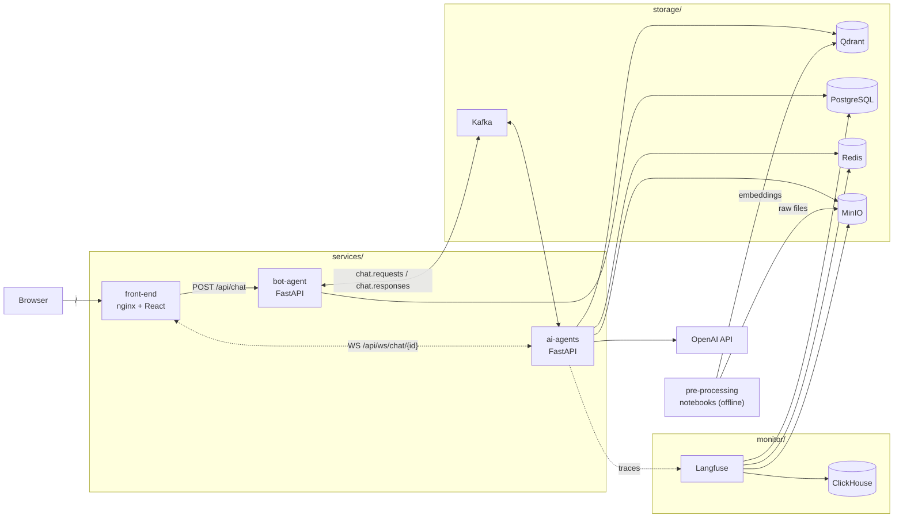

# ResuMatch AI

**An AI recruiting assistant that matches resumes to job descriptions through chat.**

Ask it things like *"find me backend engineers with 3+ years of Python"* or *"which candidates fit this data-science role in Singapore?"* — an LLM agent searches a vector knowledge base of resumes and job postings, streams its answer back token by token, and shows you which retrieval tools it called along the way.

Built as an event-driven microservices platform: React chat UI, FastAPI services connected by Kafka, Qdrant vector search, full LLM observability with Langfuse, and a two-layer RAG evaluation suite (retrieval metrics + RAGAS hallucination detection).


---

## Features

- **ChatGPT-style UI** — streaming answers with stop/regenerate, markdown rendering, follow-up suggestion chips, date-grouped history, light/dark theme.
- **Two-stage LLM agent** — a cheaper model decides *which retrieval tools to call* in a bounded tool loop; a stronger model writes the final answer from the tool transcript. Loop guards handle repeated calls, failed rounds, and a hard round cap.
- **Semantic search over resumes and jobs** — `retrieval_cv` and `retrieval_jd` tools embed the query and run grouped Qdrant searches, so each hit is one distinct candidate/job with its best-matching sections.
- **Event-driven backbone** — chat turns travel over Kafka (`chat.requests` / `chat.responses`) with an idempotent producer, at-least-once consumers, and a dead-letter topic; answers stream to the browser over WebSocket.
- **Full observability** — every chat turn is one Langfuse trace (session = conversation), down to per-round tool decisions, retriever payloads, token usage, and latency.
- **Measured, not vibes** — an evaluation package scores retrieval (MRR, accuracy@k, precision@k, NDCG@k, LLM-graded NDCG) and generation (RAGAS faithfulness, answer correctness/relevancy, context precision/recall) with a hallucination report.

## Architecture

Three Docker Compose stacks share one network (`storage-net`):



**How one chat turn works:**

1. The browser opens a WebSocket to `ai-agents` first (so no token is missed), then `POST`s the message to `bot-agent`.
2. `bot-agent` persists the message in PostgreSQL, loads the last 10 turns, and publishes everything to Kafka (`chat.requests`).
3. `ai-agents` consumes the request and runs the agent: tool loop (embed query → grouped Qdrant search, events pushed to the browser live) → streamed summary → follow-up suggestions.
4. The finished turn goes back on `chat.responses`; `bot-agent` persists the answer, tool calls, and suggestions.

| Component | Role |
|---|---|
| [`services/front-end`](services/front-end/) | Vite + React 19 + TypeScript chat UI, served by nginx (proxies `/api/*` with streaming-safe buffering) |
| [`services/bot-agent`](services/bot-agent/) | Chat entry point and history — PostgreSQL persistence, Kafka bridge |
| [`services/ai-agents`](services/ai-agents/) | The LLM agent — prompts, tools, orchestration, WebSocket streaming, Langfuse tracing |
| [`services/ai-embeddings`](services/ai-embeddings/) | Online ingestion skeleton (resume upload → extract → embed → upsert; health-only for now) |
| [`storage/`](storage/) | Kafka, Qdrant, MinIO, Redis, PostgreSQL — owns the shared `storage-net` network |
| [`monitor/`](monitor/) | Langfuse (web + worker) and ClickHouse for LLM observability |
| [`pre-processing/`](pre-processing/) | Offline pipeline notebooks + evaluation package |

Deep dives: [`project_architecture.md`](services/ai-agents/project_architecture.md) (system design, layering, contracts) and [`ai_processing.md`](services/ai-agents/ai_processing.md) (agent stages, retrieval, prompting, failure handling).

## Tech stack

| Layer | Technology |
|---|---|
| LLM & embeddings | OpenAI `gpt-4.1` (answers), `gpt-4.1-mini` (tool decisions, judging), `text-embedding-3-small` |
| Agent runtime | Plain OpenAI SDK, custom two-stage tool loop (FastAPI, async) |
| Vector search | Qdrant with grouped search + payload filters |
| Messaging | Apache Kafka (idempotent producer, DLQ) |
| Persistence | PostgreSQL (chat history, metadata), Redis (cache), MinIO (files) |
| Observability | Langfuse v3 + ClickHouse |
| Evaluation | Custom rank-aware metrics + RAGAS |
| Front-end | React 19, TypeScript, Vite, plain CSS |
| Infra | Docker Compose (3 stacks, one shared network) |

## Getting started

**Prerequisites:** Docker Desktop, an OpenAI API key, Python 3.11 and Node 20+ (only for host-mode development).

### 1. Configure environment files

Every service reads its config from a `.env` next to a committed `.env.example`. Copy them all in one go:

```bash
find . -name ".env.example" -not -path "*/node_modules/*" \
  -execdir sh -c 'cp .env.example .env' \;
cp storage/config/redis/redis.conf.example storage/config/redis/redis.conf
```

Then fill in your values:

- **Infrastructure credentials** — replace every `changeme` with a password of your choice, using the same user/password pair everywhere: `storage/config/*/.env`, `storage/config/redis/redis.conf`, `monitor/config/*/.env`, `monitor/.env`, `services/.env`, and the connection URLs in the service `.env` files (URL-encode special characters there, e.g. `@` → `%40`).
- `services/ai-agents/.env` — `OPENAI_API_KEY` (Langfuse keys come later, see [Observability](#observability)).
- `pre-processing/.env` — `OPENAI_API_KEY`.
- `monitor/config/langfuse/.env` — `SALT` and `ENCRYPTION_KEY` (`openssl rand -hex 32` each).

### 2. Start the stacks

Start `storage` first — it creates the shared network. Stop in reverse order.

```bash
(cd storage  && docker compose up -d)
(cd monitor  && docker compose up -d)
(cd services && docker compose up -d --build)
```

### 3. Build the knowledge base

The agent reads from Qdrant collections populated offline by the notebooks in [`pre-processing/`](pre-processing/):

- `preprocessing_cv.ipynb` — resumes ([Kaggle resume dataset](https://www.kaggle.com/datasets/snehaanbhawal/resume-dataset) → `gpt-4.1` structured extraction → one point per section → embeddings → Qdrant).
- `preprocess_jd.ipynb` — job ads (crawl → section parsing → semantic chunks + structured field points → Qdrant).

Query embeddings and stored embeddings must use the same model (`text-embedding-3-small`), so keep `OPENAI_EMBEDDING_MODEL` untouched.

### 4. Chat

Open http://localhost:3000 and ask for candidates or jobs.

### Endpoints

| Service | URL / port |
|---|---|
| Chat UI | http://localhost:3000 |
| ai-agents API (docs at `/docs`) | http://localhost:8000 |
| bot-agent API | http://localhost:8001 |
| ai-embeddings | http://localhost:8002 |
| Langfuse | http://localhost:3031 |
| Kafka UI | http://localhost:3310 |
| Qdrant | http://localhost:6333 |
| MinIO console | http://localhost:9011 (API: 9010) |
| PostgreSQL / Redis / Kafka | `localhost:5432` / `localhost:6379` / `localhost:29092` |

## Observability

Every chat turn is one Langfuse trace, with the conversation as the session — so a whole conversation replays as a single thread at http://localhost:3031:

```
chat (trace)
├── agent-tool          tool loop: per-round decisions, per-call retriever spans
├── agent-summary       the streamed final answer + token usage
└── suggestions         follow-up prompt generation
```

Create a project in the Langfuse UI, copy its API keys into `services/ai-agents/.env`, and verify with `GET localhost:8000/health?probe=true`. Tracing is a clean no-op while the keys are empty.

## Evaluation

[`pre-processing/evaluation/`](pre-processing/evaluation/) is a two-layer evaluation pipeline driven by `evaluation_system.ipynb`:

- **Retrieval:** LLM-generated recruiter/job-seeker queries with known relevant documents, scored with MRR, accuracy@k, precision@k, and NDCG@k against the live Qdrant collections — plus an LLM-graded NDCG pass where a judge assigns 0–2 relevance grades.
- **Generation:** single-document QA pairs answered by the *production* pipeline (same system prompt, same context shaping), scored with RAGAS — faithfulness (low = hallucination), answer correctness, answer relevancy, and context precision/recall — and summarized into a hallucination report.

Datasets are seeded and cached, so runs are deterministic and comparisons across configurations are apples-to-apples. See the [evaluation README](pre-processing/evaluation/README.md) for metric definitions and cost notes.

## Development

Each Python service runs on the host against the dockerized storage stack:

```bash
cd services/ai-agents          # same pattern for bot-agent
python -m venv .venv && source .venv/bin/activate
pip install -r requirements.txt
python main.py                 # http://localhost:8000/health

pip install -r requirements-dev.txt
pytest                         # live Qdrant/Kafka tests auto-skip when the stack is down
```

Front-end dev server with hot reload:

```bash
cd services/front-end
npm install && npm run dev     # http://localhost:3000, proxies /api to the backends
```

The services follow a strict layering (`router → handler → core → services`, config only via `setting.settings`), with vendor-swappable adapters organized by service type — see [`project_architecture.md`](services/ai-agents/project_architecture.md) §3.

## Roadmap

- `get_resume` and `score_candidate` agent tools (full records + structured fit scoring)
- Online ingestion: resume upload → Kafka → extract → embed → upsert (`ai-embeddings`)
- Redis cache and MinIO object-store adapters in `ai-agents`

## License

[MIT](LICENSE)
