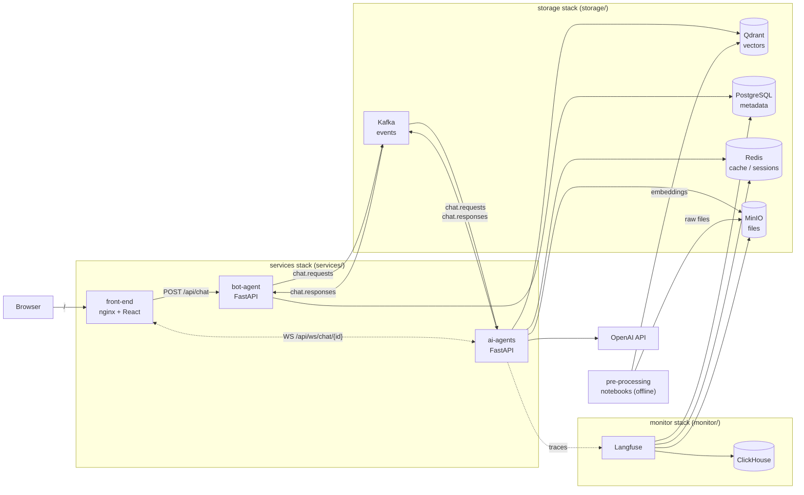
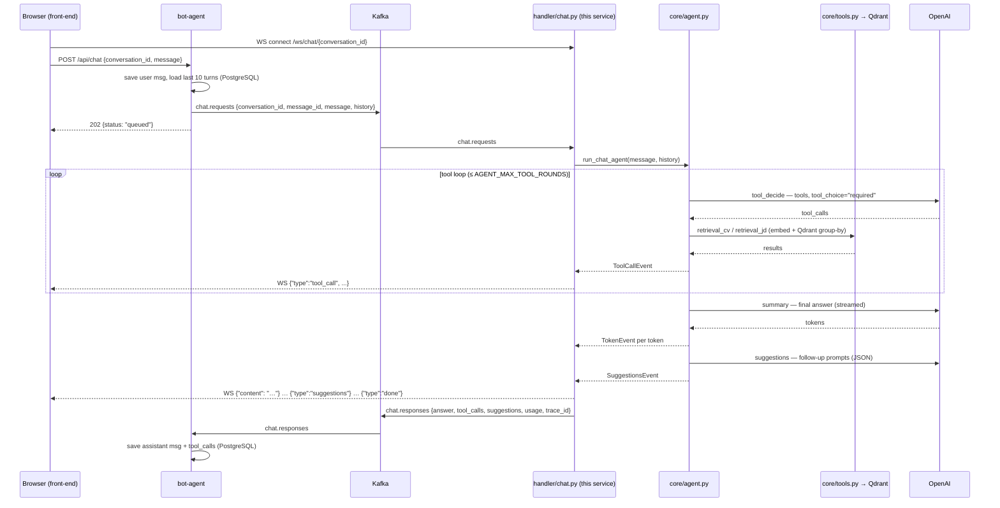
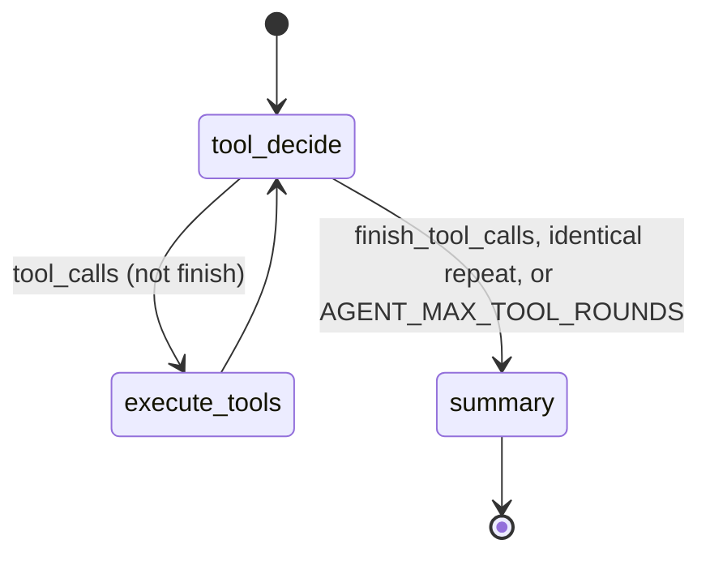

# ai-agents — Project Architecture

`ai-agents` is the FastAPI service that powers the resume-scan chatbot. It
receives chat turns from the front-end, runs an LLM agent that can query the
resume / job-description knowledge base, and streams the answer back.

This document describes where the service sits in the overall system, how it
is structured internally, the contracts it exposes, and what is implemented
today versus planned.

---

## 1. System context



| Component | Role in resume-scan |
|---|---|
| **front-end** | ChatGPT-style UI. nginx serves the bundle and proxies `/api/*` to `bot-agent:8001` and `/api/ws/*` to `ai-agents:8000` (prefix stripped, buffering off for streaming). |
| **bot-agent** | Chat entry point + history. Persists every turn in PostgreSQL, forwards each user message with the last 10 turns to `ai-agents` via Kafka, and stores the answers coming back. |
| **ai-agents** (this service) | LLM agent. Consumes chat requests from Kafka, owns prompts, tools, and orchestration, streams answers to the browser over WebSocket. |
| **Qdrant** | Vector store for resume and job-description embeddings (populated offline by `pre-processing/`). |
| **PostgreSQL** | Relational metadata (candidates, jobs, conversations). Also hosts the `langfuse` database. |
| **Redis** | Short-lived state: conversation cache, rate limits, agent scratch data. Also Langfuse's queue. |
| **MinIO** | Object storage for original resume files (PDF/DOCX) and Langfuse event uploads (bucket `langfuse`). |
| **Kafka** | Event bus for asynchronous work (e.g. "resume uploaded → extract → embed → upsert"). |
| **Langfuse + ClickHouse** | LLM observability: traces, token usage, latency per agent step. |
| **OpenAI** | `gpt-4.1` for reasoning / tool selection, `text-embedding-3-small` for query embeddings (must match the model used offline). |

---

## 2. Deployment topology

Three Docker Compose projects share one network, **`storage-net`**, so every
container resolves the others by service name.

```
storage/    owns storage-net   (networks.default.name = storage-net)
monitor/    external: true     (Langfuse stack)
services/   external: true     (front-end, ai-agents)
```

Start order is `storage → monitor → services`; stop in reverse. Because the
network persists once created, the order only matters after `docker compose
down` in `storage/`.

### Endpoints

| Service | Inside `storage-net` | From the host (macOS) |
|---|---|---|
| ai-agents | `http://ai-agents:8000` | `http://localhost:8000` |
| bot-agent | `http://bot-agent:8001` | `http://localhost:8001` |
| front-end | `http://front-end:80` | `http://localhost:3000` |
| Qdrant | `http://qdrant:6333` (container name `ai-agent-qdrant` also resolves) | `http://localhost:6333` |
| PostgreSQL | `postgres:5432` | `localhost:5432` |
| Redis | `redis:6379` | `localhost:6379` |
| MinIO API | `http://minio:9000` | `http://localhost:9010` |
| Kafka | `kafka:9092` | `localhost:29092` |
| Langfuse | `http://langfuse-web:3000` | `http://localhost:3031` |

Credentials for every storage service are set in
`storage/config/<service>/.env` (URL-encode special characters when they
appear in connection URLs).

---

## 3. Service layout and layering

```
ai-agents/
├── main.py            # FastAPI app factory + uvicorn entrypoint
├── router/            # HTTP layer: declares routes, maps endpoint -> handler
├── handler/           # Use-case layer: validates input, orchestrates core/services
├── core/              # Agent runtime: LLM client (llm.py), agent loop (agent.py),
│                      #   tools (tools.py), WebSocket registry (connections.py)
├── services/          # Adapters for external systems, one sub-folder per service TYPE
│   ├── vector_store/      #   qdrant.py   (a chromadb.py would live here too)
│   ├── message_broker/    #   kafka.py
│   └── observability/     #   langfuse.py
│                      # planned: cache/ (redis), object_store/ (minio), database/ (postgres)
├── schemas/           # Pydantic request/response models (the public API contract)
├── prompt/            # Prompt files (system prompt, templates) loaded at runtime
├── setting/           # `Settings` (pydantic-settings) read from .env / environment
└── utils/             # Cross-cutting helpers (logger, ...)
```

**Dependency direction** (only downward imports are allowed):

```
router  →  handler  →  core  →  services
   ↓          ↓         ↓         ↓
 schemas   schemas   prompt    setting
                    setting    utils
                    utils
```

- `router/` contains no logic; a route is one line calling one handler.
- `handler/` never talks to OpenAI or a datastore directly — it goes through
  `core/` (LLM / agent) or `services/` (I/O).
- `services/` functions are thin, stateless adapters that take/return plain
  Python or pydantic objects, so they can be unit-tested and mocked.
- `services/` is organised **by service type, then vendor**: one sub-folder per
  type (`vector_store/`, `message_broker/`, `observability/`, later `cache/`,
  `object_store/`, `database/`), one module per vendor inside it. Every module
  in a folder exposes the *same public function names* (listed in the folder's
  `__init__.py`), so swapping vendors is one import:
  `from services.vector_store import chromadb as vector_store`. Never import a
  vendor module from `core/` under its vendor name — alias it by type.
- `core/` must not import from `router/` or `handler/`.
- Anything that reads configuration does so via `setting.settings`, never
  `os.environ` directly.

### Adding an endpoint (the pattern used by `/health`)

1. `schemas/<name>.py` — request/response models.
2. `handler/<name>.py` — a function that takes the request model and returns the response model (or an async generator for streaming).
3. `router/<name>.py` — `APIRouter` mapping the path to the handler.
4. Register the router in `router/__init__.py` (`api_router.include_router(...)`).

### Service adapters (implemented)

All adapters are async-friendly, read configuration only from
`setting.settings`, and are covered by `tests/` (live tests skip when the
stack is down).

| Module | Functions | Notes |
|---|---|---|
| `services/vector_store/qdrant.py` | `search`, `search_grouped`, **`search_resumes`**, **`search_jobs`**, `get_resume`, `get_job`, `scroll`, `retrieve`, `count`, `build_filter`, `list_collections`, `collection_exists`, `ping`, `close_qdrant` | Takes *vectors* (embed with `core.llm.embed_text`). Domain searches use group-by on the `id` payload so each hit is one distinct resume / job with its best sections. `build_filter({"category": "IT", "id": [1,2], "years": {"gte": 3}})` covers match / any / range. |
| `services/message_broker/kafka.py` | **`produce`**, `produce_many`, **`consume`**, `start_consumer`, `stop_consumer`, `stop_producer`, `ensure_topics`, `list_topics`, `ping`; topics `TOPIC_RESUME_UPLOADED`, `TOPIC_RESUME_PROCESSED`, `TOPIC_JOB_UPSERTED`, `TOPIC_CHAT_EVENTS`, `TOPIC_DEAD_LETTER` | JSON values, string keys, topic names prefixed with `KAFKA_TOPIC_PREFIX`. Idempotent producer (`acks=all`); consumer commits per record after the handler succeeds (at-least-once), failed records go to the dead-letter topic. |
| `services/observability/langfuse.py` | **`log_trace`**, `log_span`, `log_generation`, `log_tool_call`, `log_retrieval`, `log_event`, `set_output`, `set_trace_output`, `usage_from_openai`, **`insert_score`**, `insert_feedback`, `insert_dataset_item`, `insert_prompt`, `get_prompt`, `flush`, `shutdown`, `auth_check`, `observe` | Langfuse SDK v4. Every function is a no-op when `LANGFUSE_ENABLED=false` or keys are empty. `log_trace(conversation_id=…)` sets the Langfuse session so a conversation replays as one thread. |
| `core/llm.py` | `get_llm_client`, `get_async_llm_client`, `embed_texts`, `embed_text` | Embeddings use `OPENAI_EMBEDDING_MODEL` (must stay `text-embedding-3-small`, 1536-d, to match the collections). |

---

## 4. Request flow

### `/health` (implemented)

`GET /health` → `router.health` → `handler.health.health_check()` →
`HealthResponse(status="ok", app=settings.APP_NAME)`.

### Chat turn (implemented — Kafka pipeline + WebSocket stream)



#### Contracts

Kafka (JSON values, key = `conversation_id`, topic prefix `resume-scan.`;
models in `schemas/chat.py`, mirrored in `bot-agent/schemas/chat.py`):

```
chat.requests   {conversation_id, message_id, message, history: [{role, content}]}
chat.responses  {conversation_id, message_id, answer, tool_calls: [{tool, arguments,
                 result, error}], suggestions: [str], usage, trace_id, error}
```

WebSocket `/ws/chat/{conversation_id}` (server → client, one JSON event per
frame; shapes match what the front-end already parsed for SSE):

```
{"type": "tool_call", "tool": "retrieval_cv", "arguments": {...}}
{"content": "answer token"}                    # repeated while streaming
{"type": "suggestions", "suggestions": [...]}  # follow-up prompts, when any
{"type": "done", "conversation_id": "..."}
{"type": "error", "message": "..."}
```

Conversation history lives in bot-agent's PostgreSQL; the browser sends only
the latest message. A turn with no open WebSocket still completes and is
persisted — the client just misses the live stream.

---

## 5. Agent design (`core/agent.py`)

> Full AI-processing reference — stages, retrieval, prompting, memory,
> tracing, failure handling — in [ai_processing.md](ai_processing.md). This
> section is the summary.

The agent (implemented on the plain OpenAI SDK, `core/llm.py` client) is two
stages, so *deciding which tools to call* can use a cheaper model
(`OPENAI_TOOL_MODEL`) than *writing the answer* (`OPENAI_MODEL`):



| Element | Purpose |
|---|---|
| `run_chat_agent(message, history)` | Async generator; yields `ToolCallEvent` / `TokenEvent` / final `FinalEvent`. |
| tool loop (**ai-agent**) | Binds `TOOL_SPECS` with `tool_choice="required"` and `prompt/tool_system.md`; executes the calls it picks, appends results to a tool transcript, asks again. |
| `finish_tool_calls` | A no-op tool the model **must** call to signal it has enough information. |
| loop guards | An identical repeated call is answered from cache and ends the loop; a failed round (no successful new call) ends it too; hard cap `AGENT_MAX_TOOL_ROUNDS` (default 3). |
| tool errors | Returned to the model as a friendly retry hint, recorded as `ToolCallRecord.error`. |
| summary (**ai-agent-summary**) | Streams the final answer from `prompt/system.md` + history + tool transcript; usage is aggregated across all calls. |
| suggestions | After the answer, `OPENAI_TOOL_MODEL` proposes up to `AGENT_SUGGESTIONS` follow-up prompts (`prompt/suggestion_system.md`, strict JSON output), grounded in the tool results + answer. Best-effort: failures are logged and skipped. |

### Tools (`core/tools.py`)

| Tool | Backed by | Description |
|---|---|---|
| `retrieval_cv(query, top_k, section?, category?)` | `core.llm.embed_text` + `qdrant.search_resumes` | Semantic search over resumes; one entry per candidate with its best sections. |
| `retrieval_jd(query, top_k, company?, employment_type?)` | `core.llm.embed_text` + `qdrant.search_jobs` | Semantic search over job descriptions; structured record included when a `type=field` point matched. |
| `finish_tool_calls` | — | Terminator (always registered). |
| planned: `get_resume`, `score_candidate` | Postgres / MinIO / LLM | Full record + fit scoring. |

Prompts live in `prompt/` (`system.md` for the summary stage,
`tool_system.md` for the tool loop), loaded via `prompt.load_prompt()`, never
hard-coded in Python.

---

## 6. Data pipeline (offline, `pre-processing/`)

The knowledge base is built ahead of time by two notebooks; `ai-agents` only
*reads* it.

```
pre-processing/
├── preprocessing_cv.ipynb   # data/Resume/Resume.csv → gpt-4.1 structured extraction
│                            #   → text-embedding-3-small → output/points.jsonl (+ records.json)
├── preprocess_jd.ipynb      # crawls AI / Data-Science job ads (Singapore) → jobs.json
│                            #   → section parser → jobs_chunks.json → jd_points.jsonl
└── output/                  # gpt_cache/, checkpoints/, *.jsonl ready for Qdrant upsert
```

Point kinds actually stored: a resume is split into one point per section
(`field` = `information` | `objective` | `work_exp` | `technical_skills` |
`certification`, all sharing the integer `id`); a job has `type=chunk` points
(semantic chunks, `chunk_index`) and `type=field` points (one per section,
carrying the full record: `job_title`, `company`, `requirements[]` …), all
sharing the keyword `id`.

Rules that follow from this:

- **Query embeddings must use the same model** as the offline pipeline
  (`OPENAI_EMBEDDING_MODEL=text-embedding-3-small`), or vector search is
  meaningless.
- Vector payloads carry the structured fields the LLM extracted (skills,
  years, education, …); tools should return those payloads rather than raw
  text where possible.
- Online ingestion (a user uploads a resume in the UI) is intended to reuse
  the same extraction → embedding steps, triggered via Kafka, so the offline
  and online paths converge on one implementation in `services/`.

---

## 7. Configuration

All settings are declared once in `setting/config.py` (`Settings`,
pydantic-settings) and read from `.env` or the environment. Copy
`.env.example` to `.env` and fill in `OPENAI_API_KEY` and the Langfuse keys.

| Group | Keys | Notes |
|---|---|---|
| App | `APP_NAME`, `APP_HOST`, `APP_PORT`, `DEBUG` | `DEBUG=true` enables uvicorn reload and debug logging. |
| LLM | `OPENAI_API_KEY`, `OPENAI_MODEL`, `OPENAI_EMBEDDING_MODEL` | |
| Storage | `QDRANT_URL`, `QDRANT_API_KEY`, `REDIS_URL`, `POSTGRES_URL`, `KAFKA_BOOTSTRAP_SERVERS`, `MINIO_ENDPOINT`, `MINIO_ACCESS_KEY`, `MINIO_SECRET_KEY` | Defaults point at **localhost** for running on the host. |
| Observability | `LANGFUSE_HOST`, `LANGFUSE_PUBLIC_KEY`, `LANGFUSE_SECRET_KEY` | Keys are created in the Langfuse UI (project settings). |

**Host vs. container.** The `.env.example` defaults are host addresses. When
`ai-agents` runs as a container on `storage-net`, override them with the
in-network names from §2 (e.g. `QDRANT_URL=http://qdrant:6333`,
`KAFKA_BOOTSTRAP_SERVERS=kafka:9092`, `MINIO_ENDPOINT=minio:9000`,
`LANGFUSE_HOST=http://langfuse-web:3000`). Do this with `environment:` in
`services/docker-compose.yml` so the same `.env` works in both modes.

---

## 8. Observability and logging

- `utils/logger.py` — one `logging` handler per module, level driven by
  `DEBUG`. Use `get_logger(__name__)`; never `print`.
- **Langfuse** — every chat turn is one trace (session = `conversation_id`,
  so a conversation replays as one thread at http://localhost:3031):

  ```
  chat (trace)
  ├── agent-tool     (agent)   output: {stop_reason, rounds, tool_calls: [{tool, status}]}
  │   ├── tool_decide:<n>  (generation)  the tool model's decision per round
  │   └── tool:<name>      (tool)        duration + status per call; ERROR level
  │       └── <name>       (retriever)   query + full Qdrant results
  ├── agent-summary  (agent)   output: the final answer
  │   └── summary          (generation)  streamed answer + token usage
  └── suggestions    (generation)  follow-up prompts
  ```

  `stop_reason` is one of `finish_tool_calls` | `no_tool_calls` |
  `no_progress` (only repeats/failures in a round) | `max_rounds`; per-call
  `status` is `ok` | `error` | `repeat`. Tracing is a no-op until
  `LANGFUSE_PUBLIC_KEY` / `LANGFUSE_SECRET_KEY` are set in `ai-agents/.env`
  (project "resume" → Settings → API Keys); verify with
  `GET /health?probe=true` → `"langfuse": true`.

---

## 9. Current status and roadmap

| Area | Status |
|---|---|
| FastAPI skeleton, layering, `Settings`, logger | ✅ done |
| `GET /health` | ✅ done |
| OpenAI client (`core/llm.py`) | ✅ done |
| Chat pipeline per §4 (Kafka in, WebSocket out) | ✅ done — `handler/chat.py`, `handler/ws.py`, lifespan wiring in `main.py` |
| Agent runtime (`core/agent.py`) | ✅ done — two-stage tool loop + streamed summary on the plain OpenAI SDK |
| Tools `retrieval_cv` / `retrieval_jd` (`core/tools.py`) | ✅ done; ⬜ `get_resume`, `score_candidate` |
| Prompts (`prompt/system.md`, `prompt/tool_system.md`) | ✅ done |
| Langfuse instrumentation | ✅ done — one trace per turn (session = conversation id), generation per LLM call, retriever span per tool call |
| bot-agent (chat history, PostgreSQL, Kafka bridge) | ✅ done — see `services/bot-agent/` |
| `services/` adapters | ✅ `vector_store/qdrant`, `message_broker/kafka`, `observability/langfuse`; ⬜ `cache/redis`, `object_store/minio` (`database/postgres` lives in bot-agent) |
| Dockerfiles + compose entries (`ai-agents`, `bot-agent`, `ai-embeddings`) | ✅ done — python:3.11-slim images, healthchecks, in-network env overrides in `services/docker-compose.yml` |
| Kafka consumer for online ingestion (resume upload) | ⬜ later — `ai-embeddings` skeleton (health only) is in place for it |
| Tests | ✅ `pytest` — agent loop / chat handler / WS registry with fakes; live Qdrant / Kafka tests (skip when the stack is down); Langfuse against an in-process mock |

### Suggested order

1. **Remaining tools** — `get_resume` (full record + MinIO link),
   `score_candidate` (structured fit scoring).
2. Online ingestion in `ai-embeddings` (upload → Kafka → extract → embed →
   upsert) and the remaining adapters (`cache/redis`, `object_store/minio`).

---

## 10. Running locally

```bash
cd services/ai-agents
python -m venv .venv && source .venv/bin/activate
pip install -r requirements.txt
cp .env.example .env            # add OPENAI_API_KEY, Langfuse keys
python main.py                  # http://localhost:8000/health  (docs at /docs)

pip install -r requirements-dev.txt
pytest                          # live Qdrant/Kafka tests need the storage stack up
```

With the storage stack up (`cd storage && docker compose up -d`) the default
`.env` addresses already point at it. A full turn also needs **bot-agent**
(`cd services/bot-agent && python main.py`, port 8001). Run the front-end with
`npm run dev` in `services/front-end`; it proxies `/api/*` to bot-agent and
`/api/ws/*` to this service.

### Running in Docker

Every application service has a Dockerfile and a compose entry
(`services/docker-compose.yml`, network `storage-net`, in-network addresses
injected via `environment:`). Secrets still come from `ai-agents/.env`
(`OPENAI_API_KEY`, Langfuse keys), loaded with an optional `env_file`.

```bash
cd services
docker compose up -d --build     # front-end :3000, ai-agents :8000,
                                 # bot-agent :8001, ai-embeddings :8002
```
